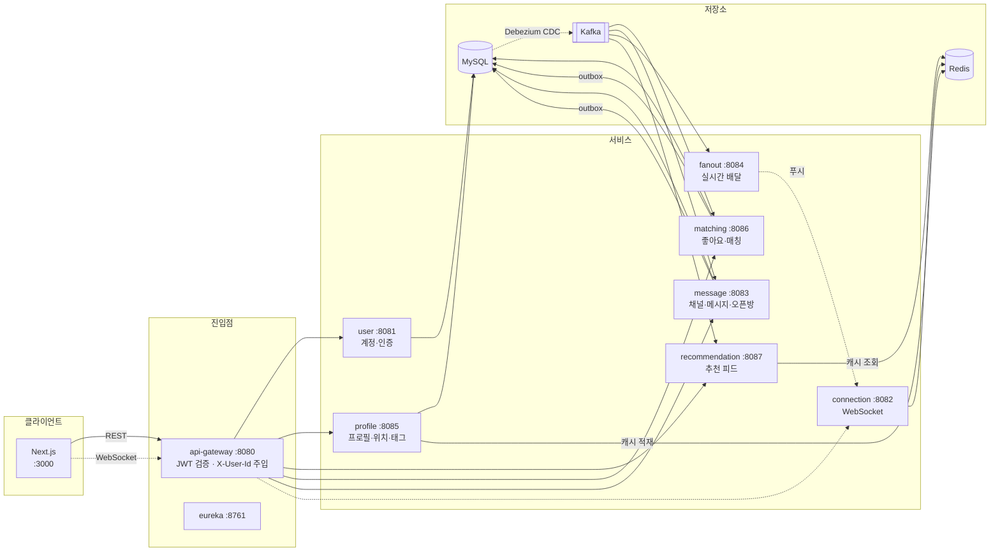
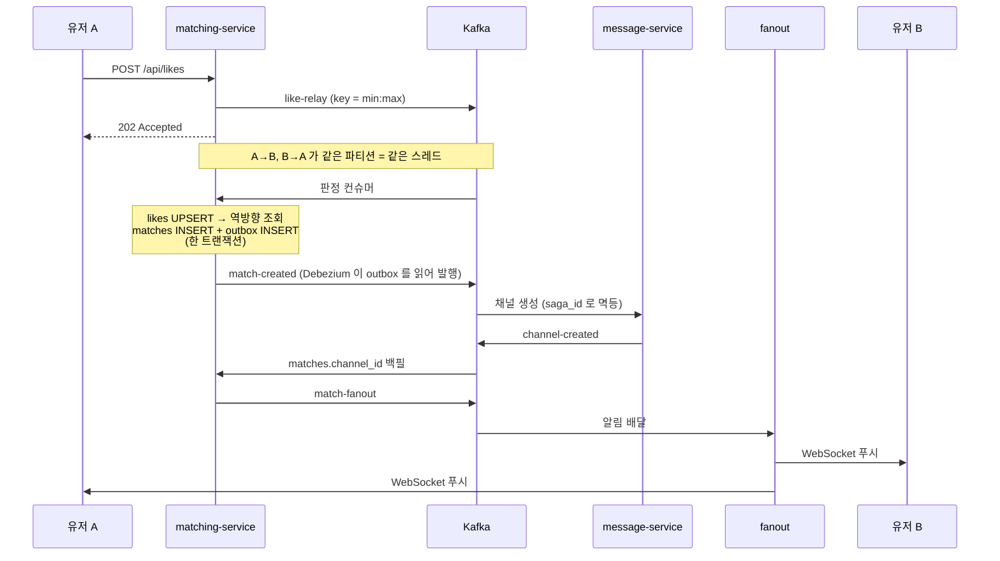

# Social Discovery

위치와 관심사로 사람을 찾고, 서로 좋아요를 누르면 매칭돼서 실시간 채팅으로 이어지는 소개팅 앱. 오픈채팅방도 있다.

기능 자체보다 **"동시에 눌러도 매칭이 어긋나지 않는다"를 코드로 증명하는 것**이 목표인 프로젝트다. 그래서 좋아요 판정, 채널 생성, 알림 발송이 전부 Kafka를 거치는 비동기 파이프라인으로 짜여 있고, 각 단계마다 어긋나지 않는 이유가 코드에 남아 있다.

## 어떻게 동작하나



프로필을 만들면 profile-service가 MySQL에 쓰고 **Redis에도 같이 적재한다**(`geo:users`, `profile:card:`, `profile:pref:`). 추천은 이 Redis만 읽는다. DB를 안 보기 때문에 반경 검색과 랭킹이 왕복 6회로 끝난다.

좋아요를 누르면 matching-service는 판정하지 않고 `like-relay`에 던지고 202로 끝낸다. 사용자는 기다리지 않는다. 판정은 컨슈머가 한다.

## 정합성 설계

이 프로젝트의 핵심이다. 매칭이 성사되는 순간을 예로 보면 이렇게 흐른다.



네 가지 장치가 겹쳐 있다.

**파티션 직렬화.** `like-relay`를 발행할 때 키를 두 사람의 UUID를 정렬한 `min:max` 문자열로 만든다. 카프카가 그 키를 해싱해 파티션을 고르니, A→B와 B→A는 키가 같아서 항상 같은 파티션에 들어간다. 같은 파티션은 한 컨슈머 스레드가 순서대로 처리하니, 두 사람이 같은 밀리초에 서로를 눌러도 판정이 엇갈릴 수 없다. 락이 없는데 락 효과가 나는 부분이다.

**UNIQUE 이중 안전망.** 그래도 `matches`에 `UNIQUE(user_lo_id, user_hi_id)`를 걸어뒀다. 정렬 저장이 전제라 중복 매칭은 DB가 막는다. `likes`도 PK가 `(from, to)`라서 같은 사람에게 또 눌러도 흡수된다.

**outbox 한 트랜잭션.** 매칭을 저장하는 트랜잭션에서 이벤트 행도 같이 넣는다. "DB엔 매칭이 있는데 알림은 안 갔다" 같은 어긋남이 구조적으로 안 생긴다. 발행은 Debezium EventRouter가 `outbox` 테이블을 CDC로 읽어서 `destination_topic` 컬럼이 가리키는 토픽으로 보낸다(`partition_key`가 카프카 키가 된다). message-service는 같은 테이블을 폴러로도 읽는다.

**Saga로 채널 백필.** 매칭이 성사된 순간엔 채팅방이 없다. message-service가 채널을 만들고 `channel-created`로 알려주면 matching-service가 `matches.channel_id`를 채운다. 알림은 백필이 끝난 뒤에 쏘기 때문에, 사용자는 알림 하나로 바로 채팅방을 열 수 있다.

## 서비스 구성

| 서비스 | 포트 | 하는 일 | 소유 테이블 |
|---|---|---|---|
| eureka-server | 8761 | 서비스 디스커버리 | — |
| api-gateway | 8080 | 라우팅, JWT 검증, `X-User-Id` 주입, WS 프록시 | — |
| user-service | 8081 | 회원가입·로그인·토큰 | `users` |
| profile-service | 8085 | 프로필(멀티), 위치, 태그, 이미지 | `profile` `profile_location` `profile_image` `tag` `profile_tag` |
| recommendation-service | 8087 | 추천 피드 서빙 (Redis만 읽는다) | — |
| matching-service | 8086 | 좋아요 접수, 매칭 판정, 언매치 | `likes` `matches` |
| message-service | 8083 | 채널·메시지·오픈채팅방 | `channel` `channel_members` `message` |
| connection-service | 8082 | WebSocket 세션, presence | — |
| fanout-delivery-service | 8084 | 접속 인스턴스로 실시간 배달 | — |
| frontend | 3000 | Next.js 화면 | — |

모든 서비스가 단일 스키마 `social`을 공유한다. 서비스 경계는 테이블 소유권으로만 나누고 크로스 서비스 FK는 걸지 않는다.

## 기술 스택

Java 21 · Spring Boot 3.3.5 · Spring Cloud 2023.0.3 · Gradle 8.13 (Kotlin DSL, 멀티모듈)
MySQL 8.0.33 · Redis 7 · Kafka (confluent 7.6.1) · Debezium Connect 3.1
Next.js 16 · React 19 · TypeScript 5 · Tailwind 4

관측은 서비스마다 actuator + micrometer-prometheus가 붙어 있고, OpenTelemetry 자바 에이전트 설정도 준비돼 있다(로컬 실행에서는 주석 처리, Dockerfile에서는 사용).

## 데이터가 사는 곳

**Kafka 토픽** (전부 파티션 3, RF 1)

| 토픽 | 흐름 |
|---|---|
| `message-relay` / `read-relay` | connection → message |
| `message-fanout` / `read-fanout` | message(outbox) → fanout |
| `like-relay` | matching REST → matching 판정 컨슈머 |
| `match-created` | matching(outbox) → message (DIRECT 채널 생성) |
| `channel-created` | message(outbox) → matching (channel_id 백필) |
| `match-fanout` | matching(outbox) → fanout (매칭 알림) |
| `match-unmatched` | matching(outbox) → message (채널 CLOSED) |

**Redis 키**

| 키 | 용도 |
|---|---|
| `geo:users` | 프로필 좌표 (GEOSEARCH 반경 검색의 입력) |
| `profile:card:{userId}` | 프로필 카드 캐시 — 추천·매칭 목록이 MGET으로 읽는다 |
| `profile:pref:{userId}` | 추천 필터 기준값 (본인 것만 읽는다) |
| `tags:{profileId}` | 관심사 태그 집합 |
| `seen:{userId}` | 이미 스와이프한 상대 |
| `feed:{userId}` + `feed:ver:{userId}` | 추천 스냅샷과 버전 (커서 페이지네이션 기준) |
| `ws:user:` `ws:connection:` | WebSocket 세션 위치 |
| `channel:members:` `unread:` | 채널 멤버 캐시, 미읽음 카운터 |

캐시는 전부 파생 데이터라 TTL로 관리한다. 원본은 MySQL이다.

## 로컬에서 돌리기

**사전 준비**: Docker, JDK 21, Node 22.

```bash
# 인프라 + 빌드 + 서비스 전체 기동
./scripts/start.sh

# Debezium 커넥터 등록 (처음 한 번)
./infra/register-debezium.sh

# 상태 확인
./scripts/status.sh
```

`start.sh`가 Docker Compose로 인프라를 올리고, Kafka 토픽을 만들고, 서비스를 순서대로 띄운 다음 프론트까지 기동한다. 로그는 `logs/`, PID는 `pids/`에 쌓인다.

```bash
SKIP_BUILD=true ./scripts/start.sh          # JAR 이 이미 있을 때
./scripts/restart.sh profile-service        # 한 서비스만 재기동
./scripts/logs.sh message-service 200       # 로그 마지막 200줄
./scripts/stop.sh                           # 전체 종료
```

**들여다볼 수 있는 곳**

| | 주소 |
|---|---|
| 앱 | http://localhost:3000 |
| Kafka UI | http://localhost:9090 |
| RedisInsight | http://localhost:5540 |
| Kafka Connect | http://localhost:28083 |
| MySQL | `localhost:23306` (`dev_user` / `dev_password`, DB `social`) |

## 테스트 데이터와 데모

빈 DB로는 아무것도 안 보인다. 추천 피드는 반경 안에 사람이 있어야 뜨고, 매칭은 상대가 있어야 성사된다. 그래서 시더가 따로 있다.

```bash
# 강남역 반경 3km 에 1000명 (+ 시딩 직후 피드로 확인)
node scripts/seed.mjs --count 1000 --concurrency 24 --verify

# 봇을 띄우면 시드 계정이 실제 사용자처럼 움직인다
node scripts/demo-bots.mjs --demo-email seed0@seed.local --bots 8

# 정리
./scripts/seed-clean.sh --dry-run
./scripts/seed-clean.sh --yes
```

브라우저에서 `seed0@seed.local` / `qwer1234`로 로그인하면 받은 좋아요가 쌓여 있고, 스와이프하면 몇 초 뒤 매칭 알림이 오고, 상대가 먼저 말을 건다. 봇을 띄운 터미널에서 `auto off`를 치면 봇이 스스로 아무것도 안 하게 되고, `say <말>`로 대사를 직접 넣을 수 있다. 시연할 때 타이밍을 맞추기 좋다.

시더는 **실제 API 경로로** 데이터를 넣는다. SQL로 밀어넣으면 Redis 캐시가 비어서 피드가 영원히 빈 채로 남기 때문이다. 옵션과 예시는 각 스크립트의 `--help`에 있다.

## 문서

설계 문서는 [`.reference/`](.reference)에 있다.

| 문서 | 내용 |
|---|---|
| [`features.md`](.reference/features.md) | 기능 정의서 — Phase 0~4, 각 기능의 정합성 포인트 |
| [`schema.sql`](.reference/schema.sql) | 테이블 설계와 인덱스, 설계 메모 |
| [`design.html`](.reference/design.html) | 아키텍처 도식 |
| [`matching-service-design.md`](.reference/matching-service-design.md) · [`recommendation-service-design.md`](.reference/recommendation-service-design.md) | 서비스별 설계 |
| [`openchat-spec.md`](.reference/openchat-spec.md) · [`recommendation-feed-cursor.md`](.reference/recommendation-feed-cursor.md) | 오픈채팅, 커서 페이지네이션 상세 |

API 요청 예시는 [`http/`](http)에 IntelliJ HTTP Client 형식으로 있다.

## 진행 상황

Phase 0~3(프로필·위치·태그 → 매칭 코어 → 추천 피드 → 오픈채팅)까지 구현돼 있고 프론트도 로그인부터 실시간 채팅까지 붙어 있다.

남은 것과 알려진 문제는 이렇다.

- **Phase 4 (부하·정합성 증명)**: k6 시나리오와 Grafana 대시보드가 아직 없다. 시더가 생겼으니 모수는 준비됐고, micrometer도 이미 붙어 있어서 prometheus/grafana만 올리면 지표가 들어온다.
- **테스트가 없다.** 동시 스와이프로 검증한 정합성이 회귀 테스트로 고정돼 있지 않다. Testcontainers 기반 통합 테스트가 필요한 자리다.
- **컨슈머 에러 핸들러**: matching·recommendation 컨슈머에 DLQ·백오프 설정이 없다. 예외가 나면 파티션이 막힐 수 있다.
- **커넥션 풀**: profile-service만 30으로 올려뒀다(`DB_POOL_SIZE`). 나머지는 기본값 10이라 부하를 걸면 먼저 막힐 것이다.
- **moderation**: 차단·신고가 없다. 추천 필터에도 차단 제외가 빠져 있다.
- **컨테이너화**: Dockerfile이 api-gateway와 fanout-delivery-service에만 있다.
